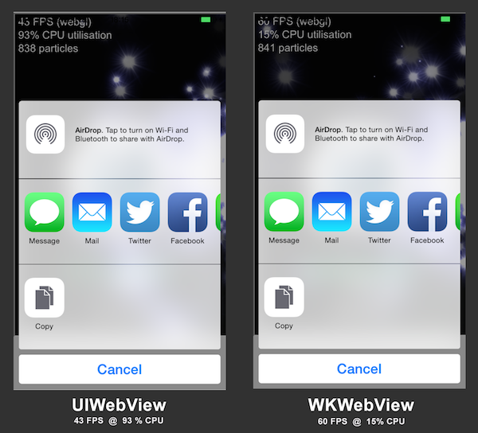

####Demo ScreenShot

A screenshot from his demo app running a performance test in the standard Hello World app using the new plugin versus without it is shown below. Notice the difference in FPS (frames per second) and CPU by using this plugin:

####Note:
Here is a test iOS app that can be used to open any website using either UIWebView or WKWebView and you can compare performance, and then decide on whether to use WKWebView or UIWebView:
https://itunes.apple.com/app/id928647773?mt=8&at=10ltWQ